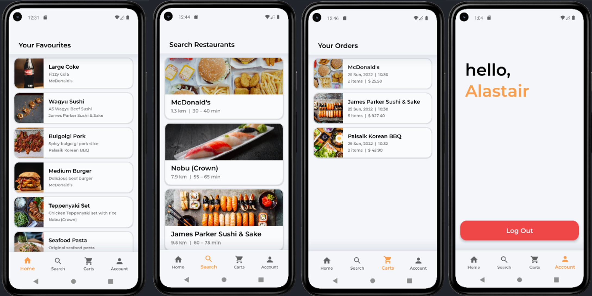
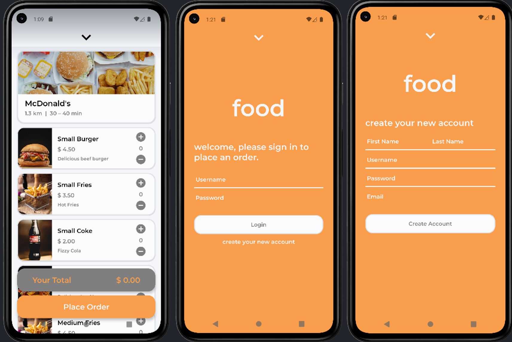
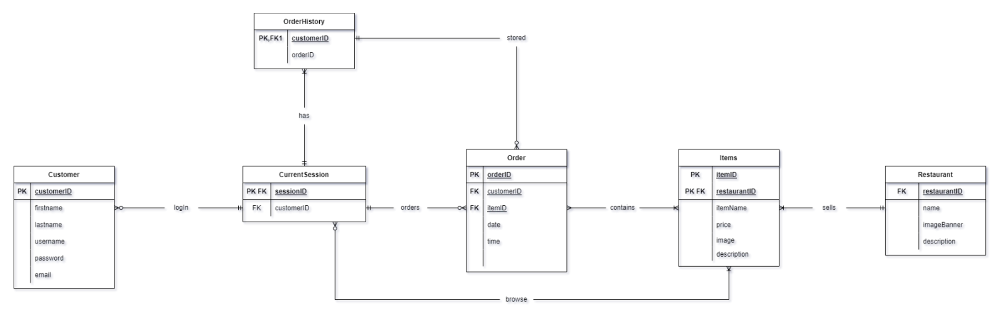
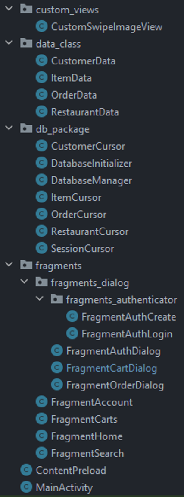
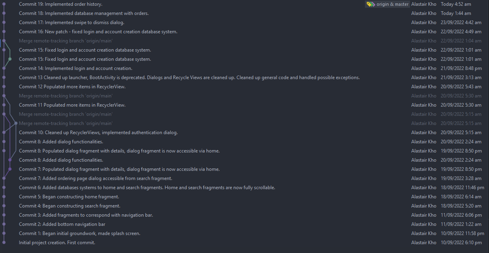

# Food Delivery Mobile Application



## Requirements
Min SDK: API 31 (Android 12.0 S) 

## Demo
A functional demo with Android Studio is available.
Git clone on Android Studio and run with the emulator or plug in with your Android Device!
```
git clone https://github.com/alastairrr/food.git
```
## App

### Accounts
**NOTE - No accounts are initialised - to use the app, please make an account via the app to be registered on the database (click on *Account* tab), a login dialog will appear**
This dialog is also dismissible by swiping or tapping from the arrow pointing down (situated at the top of the dialog fragment) or pressing the back button (swiping left to right or vice versa with newer API versions). A new account can also be created by pressing “create your new account” under the login button in ***Account***. 

A new account requires a unique username (not existing in the database), as well as a valid and unique email (must be formatted correctly with “@” and the domain name, i.e., johnsmith **@** gmail.com). If a user is logged-in, the customer will be presented with a log out button in the ***Account** tab should they wish to change accounts. 

### App Navigation
The user must use the bottom navigation bar to navigate between the views. The home screen is the landing page after the splash screen. This ***Home*** screen presents the users with a random list of items from different restaurants. This set of items will remain the same until the application is closed and rebooted. The application draws all data from an initialised database that inserts data on first boot of the app.

The ***Search*** section enables the user to search items by restaurant. This section provides the user with a list of restaurants, in which when a restaurant entry is clicked, a dialog for order will appear. 

Clicking on an entry from ***Home*** and ***Search*** will bring a popup dialog that enables the user to make orders via the ***“place order”*** button. Dismissing any dialog fragments (by any means other than pressing the “place order” button) will result in the cart being cleared, meaning item quantities are required to be re-entered as the cart does not save if the user exits this menu. This is intended to prevent confusion whilst ordering.



The ***Carts*** section in the navigation baris the ***Ordering History***, i.e. pressing any ***“place order”*** button will send the entries to the ***Carts*** page. Clicking on any entry will bring a dialog fragment up that presents a breakdown of the order. 

A user must be logged in for their respective order history to show; otherwise, a login dialog will appear, prompting the user to log in. ***Carts*** section will be blank and show no past orders if a user is not logged in.

## Database Schema


## Source Structure


The overall source structure is split into different sub packages. Custom views consist of a custom ImageView that allows a swiping gesture to be registered (used for dialog fragment dismissing button). “data_class” package consists the data object classes used in the application. The “db_package” consists of core database management source code, including setters and getters to interact with the database. The “fragments” package consists of all of the relevant fragments inflated in their corresponding views. The “ContentPreload” java file consists of arrays of items and restaurants that loads data (occurring once at the first launch of app) into the database, and finally the “Main Activity” manages the core navigation view.

## Git Logs Prior to GitHub Push


